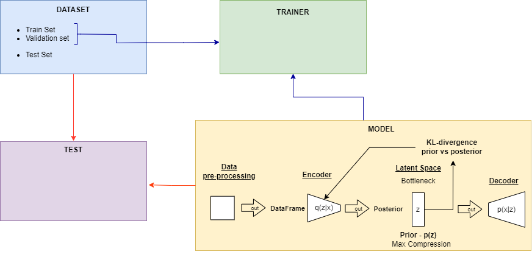

# MAEC - L04-Music-Generation
Repository for Music and Acoustics Engineering Capstone 2022/23 Course





- **Dataset** 
- **Model** 
- **Trainer** 
- **Tester** 

## Local environment

The required Python version is `3.11.x`.

To manage Python versions in your system the suggested tool is `pyenv`.

For packages and virtual environment management the chosen tool is `pipenv`.

### Setup
1. Download and install [PyCharm IDE](https://www.jetbrains.com/pycharm/download/#section=linux).
2. Install Python's version management tool:
   - Linux/macOS: [`pyenv`](https://github.com/pyenv/pyenv)
   - Windows: [`pyenv-win`](https://github.com/pyenv-win/pyenv-win)
3. Install `pipenv`. A guide is available [here](https://pipenv.pypa.io/en/latest/installation/).
   - For Windows remember to add the `pipenv` command to the user PATH:
     - Search &rarr; Edit system environment variables &rarr; Environment variables &rarr; User Variables &rarr; PATH &rarr; New
     - Insert the path to Python's script folder, usually is something like `C:\Users\[username]\AppData\Roaming\Python\Python3[xxx]\Scripts` 
4. Create a new PyCharm project from this GIT repository.
    - From PyCharm's Welcome Screen &rarr; Get from VCS &rarr; Paste the link to this repository
5. Initialize the virtual env and download the required packages:
   - Linux/macOS: `PIPENV_VENV_IN_PROJECT=1 pipenv sync --dev`
   - Windows CMD: `set PIPENV_VENV_IN_PROJECT=1 & pipenv sync --dev`
   - Windows PS: `$env:PIPENV_VENV_IN_PROJECT = 1; pipenv sync --dev`
6. Now you should have a `.venv` folder in the project's root directory
   - [Optional] If you want you can add it to the excluded folder for the project
7. Activate the new virtual environment, in PyCharm:
   - File &rarr; Settings &rarr; Project Interpreter &rarr; Add Interpreter &rarr; Add Local Interpreter
   - Virtual Environment &rarr; Select Existing &rarr; Set the interpreter path to the `.venv` folder
   - Restart PyCharm to make changes effective
8. Create your `/config/config.ini` file from `/config/config.ini.sample`.

### Install new Python packages
If you need a new package while developing, always use `pipenv`:
```shell script
# Use [package_name]==[version] to install a specific package's version 
# If you don't specify any version Pipfile package requirement will be inserted with '*' (allow any version)
# Use -d option to install the package as dev-requirement
pipenv install <package>
```
This will update the `Pipfile` and `Pipfile.lock` files and share the requirements with the other developers and 
environments.
